## 类库的创建 
+ 我这里创建c# 类库一般都给max scirpt 来调用   
+ 创建步骤 
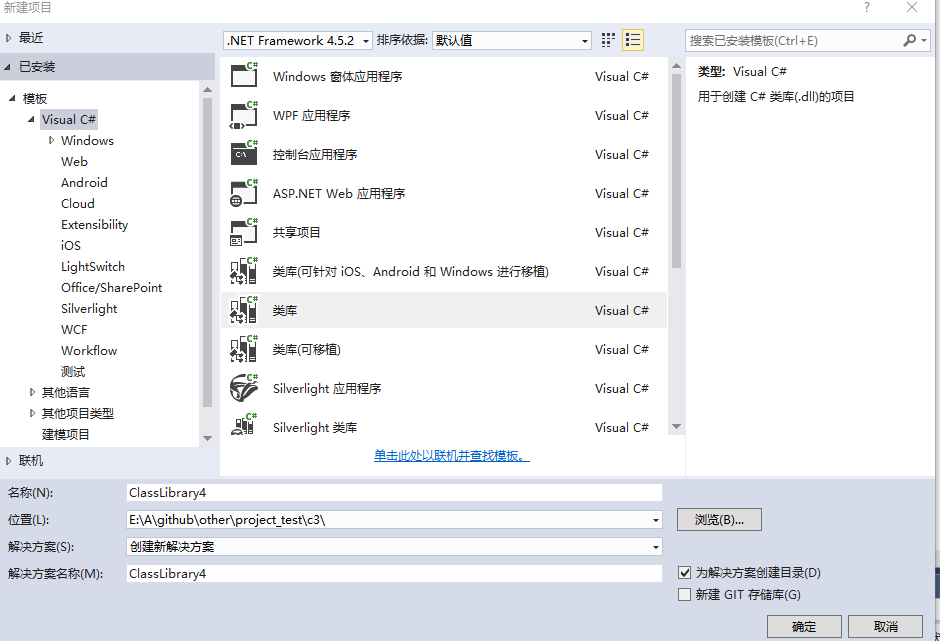  
使用 vs 编辑器 创建 c# 工程选择类库就可以了   

+ 有时候有一些ui等操作， max是没有,可以利用c#制作界面maxscript直接对应事件就可以了，就需要添加对用索引，  
+ 我这里一vs2015例子 ，创建界面需要加入 对应的引用   
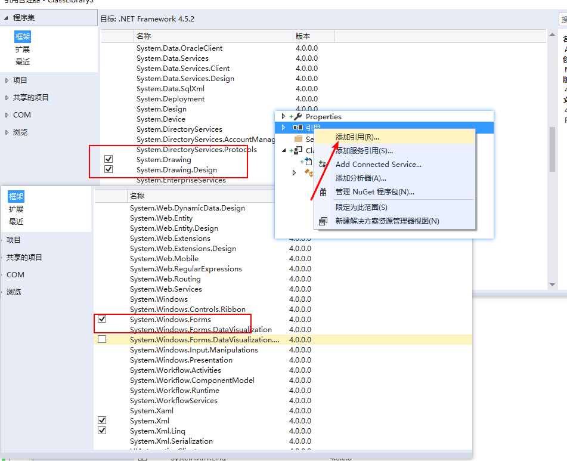  
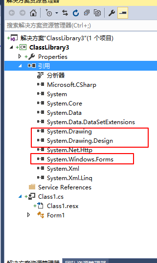    

+ 设计ui  按照下面操作，就可以向window 程序一样 拖拽控件，然后 设置修改更改 
+ 添加用户控件      
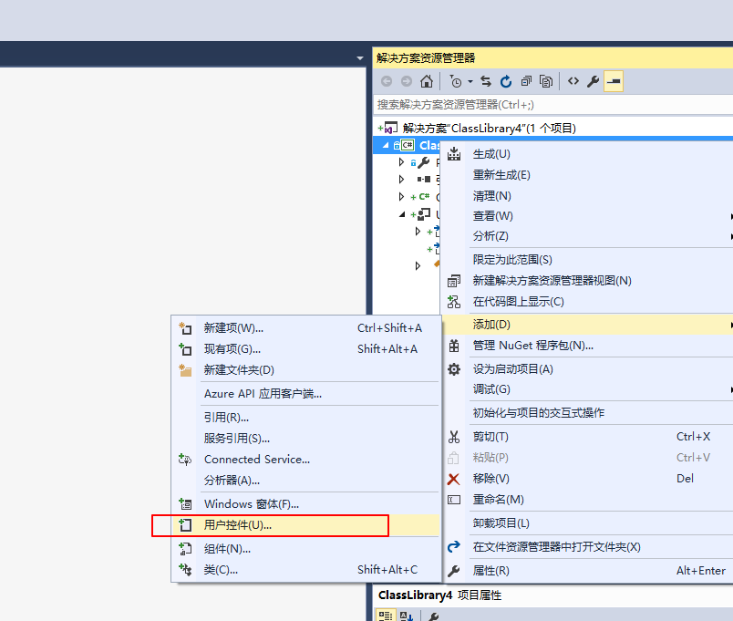   
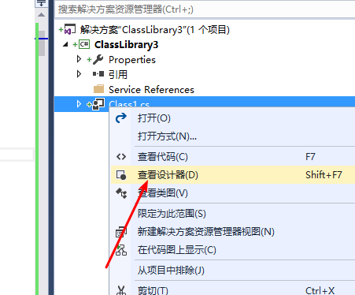   
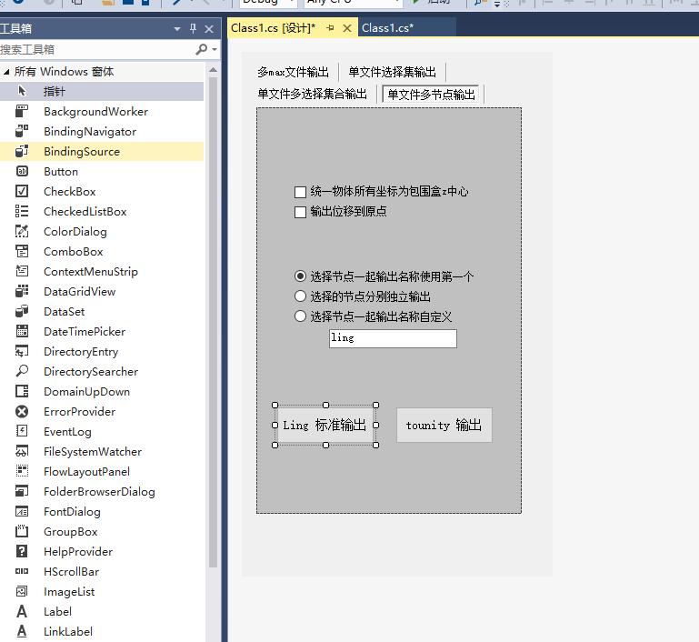    

+ 设计完成后 ，生产解决方案  对用目录生产dll   文件 

### max 可以访问的中中中点点点   
****
****
####  这里说明ui 必须使用特定格式创建
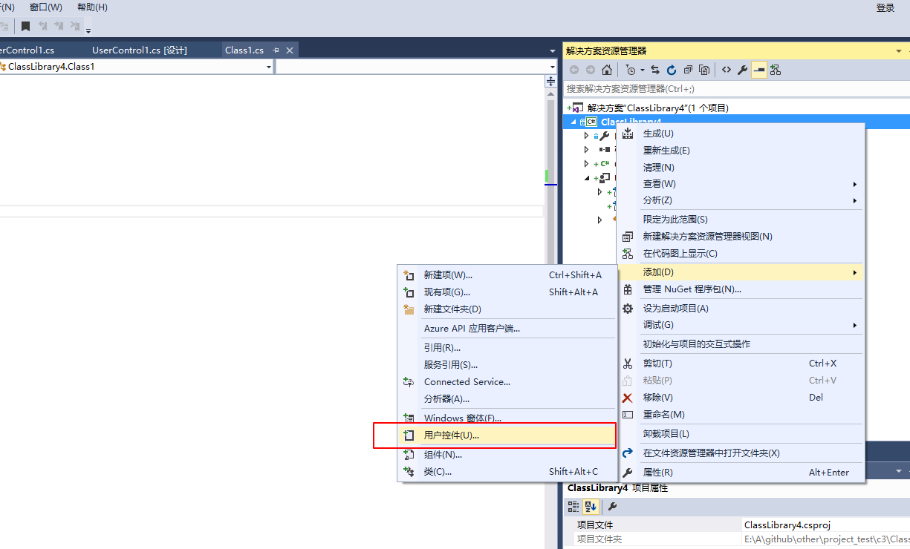   
+ 一定要添加用户控件的形式 处理   

+ 直接类继承虽然也可以在c#中显示出来， 但是max script 调用不成功  
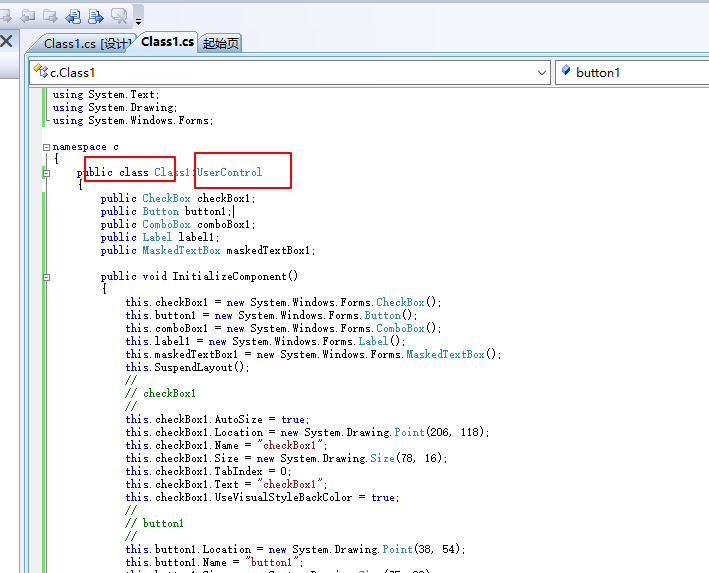   
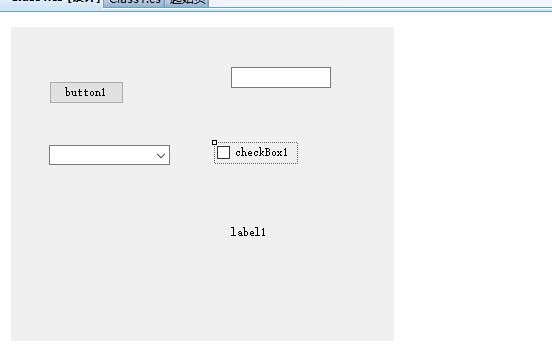  
****

### max中调用  
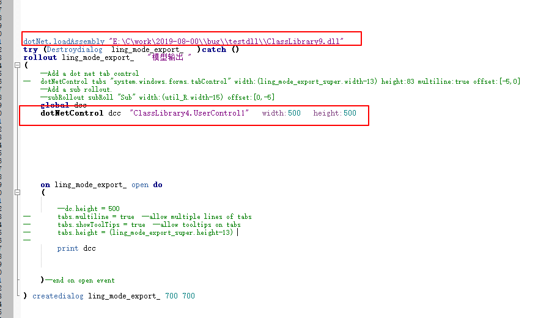   

+ 运行脚本   
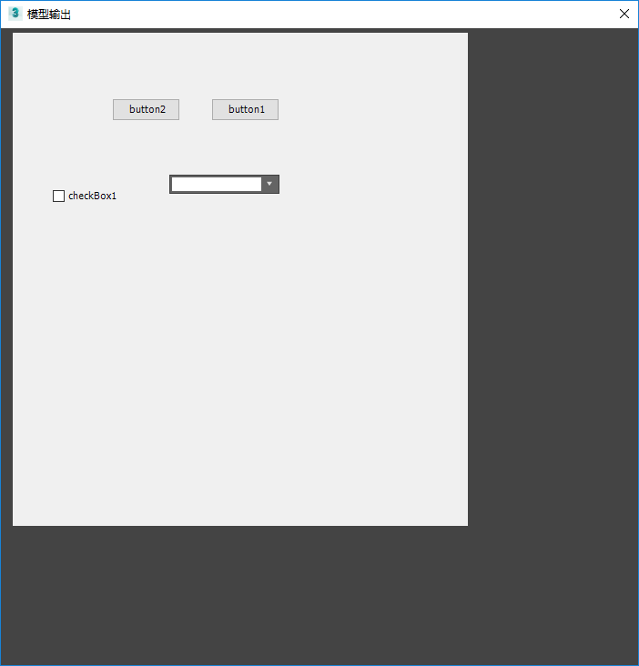   

#### 3dsmax中调用脚本事件的方法     
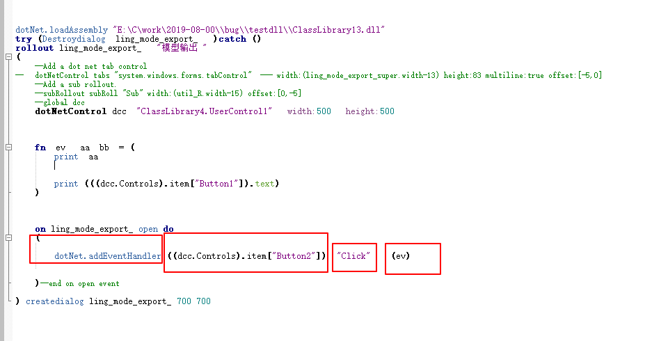   
  
+ 在打开时候创建事件手柄，加入对应的事件 添加对应对的函数   

+ 测试成功   
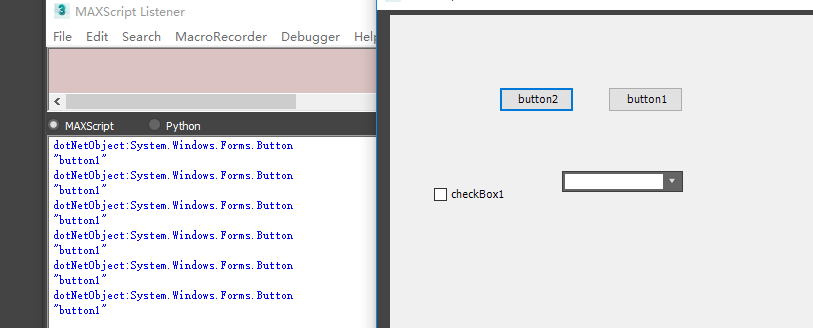   

