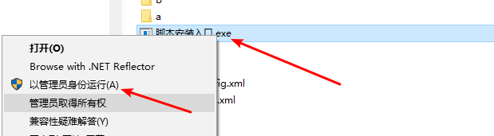
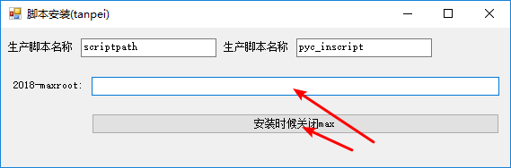
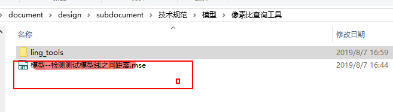
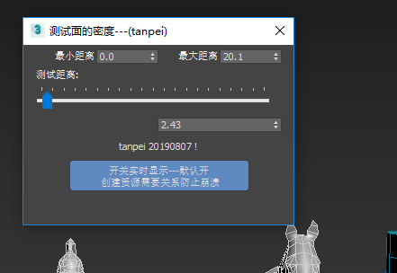

## 工具安装过程 

#### 找到ling_tools 文件夹    
           
+ 注意使用管理员完成安装     
+ 注意安装时候max需要关闭     
          
+ 注意 是安装到3dsmax 2018 的根目录
+ 点击安装完成   

#### 找到ling_tools 同目录的启动文件   
    
+ 注意 每个工具提供 都是这种形式    
  + 一个依赖库 
  + 一个启动文件 
+ 启动max 后  ，鼠标点击 启动文件拖拽到max 视图中 完成安装       
       
&emsp;类似这种看到工具界面就安装成功了 

