# max中烘焙法线到sp

[说明](#说明)  
[法线格式](#法线格式)  
[max到spp 测试](#max到sp-测试)  

### 结论： 
+   **max中输出法线需要和sp制作时候选择dx opengl 环境一样就可以.**
+  **sp 制作完成，根据具体项目输出 dx or opengl 格式法线**
+   **Ling 项目使用sp输出的opengl 格式法线**

#### 说明：
&emsp; 在与美术合作过程种，发现即使spp 有整套的烘焙制作流程，但是 还有很多同学使用 在max中出法线，有相关测试， 说maya 烘焙的法线会比max 好， max 也会比现在的spp 烘焙的好. [链接](https://www.zhihu.com/question/64834376)

&emsp;经测试spp默认是dx格式法线， 所以 如果max中出的法线，是为了进spp 进一步制作金属度，粗糙度， 应该输出dx格式法线，然后在spp制作， 最后法线输出是 dx 还是 opengl格式 按照项目要求从spp中 输出就可以 

#### 法线格式 
+ 下图就是具体法线区别(参与烘焙高模是凸起)， 具体表现在 g通道上上 
  
+ r 通道   
&emsp; 对于x 通道朝向统一向右
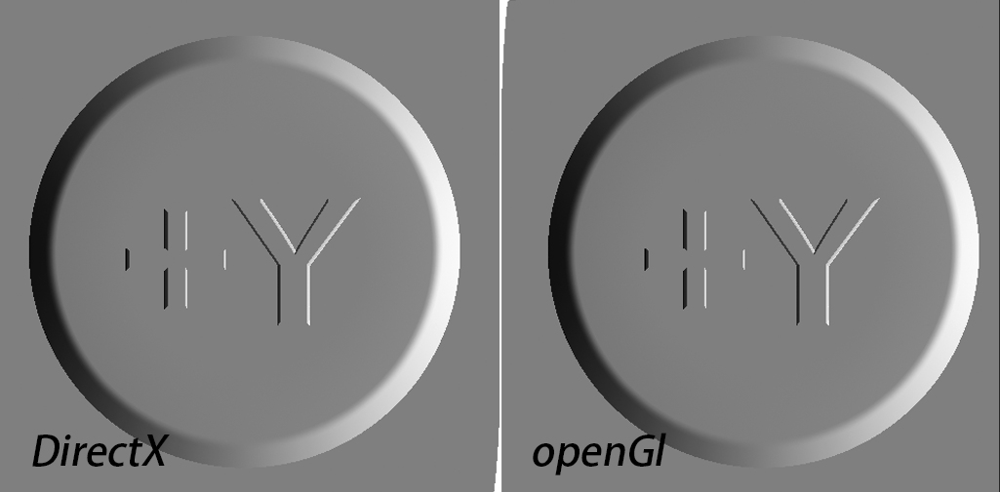  
+ g 通道   
&emsp;主要体现在 g通道 光照方向上， opengl 光照是从上线下照， directx 是从下向上照 
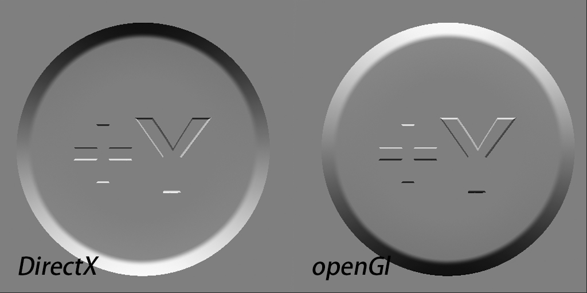   

#### max到spp 测试
+ max中 测试 模型    
&emsp; 高低模型  
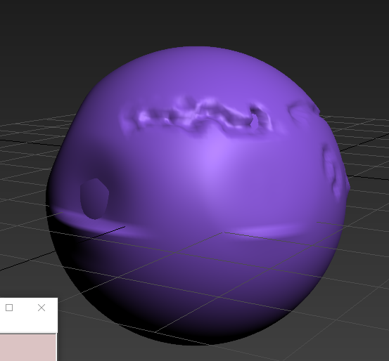  

+ 生产opengl 法线   
&emsp; 这里的 up 从上面照   
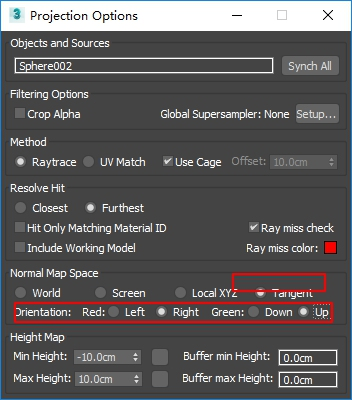   

+ 生产了 dx法线    
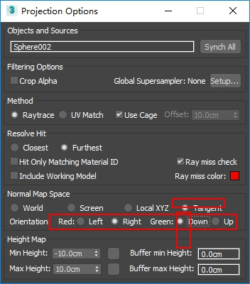    

+ 到spp中 默认dx格式     
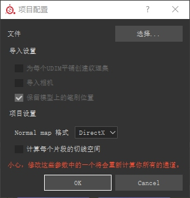  
  + 导入贴图   
  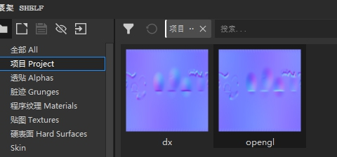  
  + 给dx格式发线     
  &emsp;默认的环境球，默认的强度， 可以进行一些旋转。   
  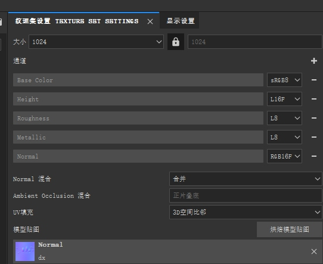  
  &emsp;dx格式下，放入dx格式正确   
  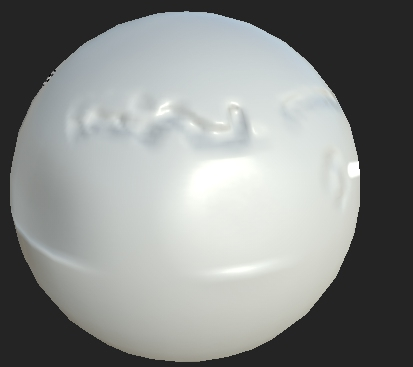    
  
+ 到spp中 默认opengl格式      
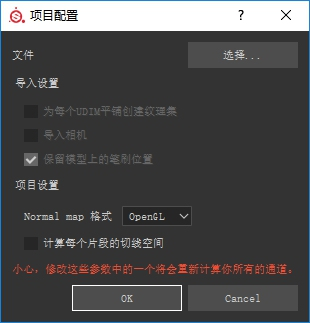    
  + 导入贴图     
   &emsp;默认的环境球，默认的强度， 上面旋转环境球保持不动。     
        
  &emsp;opengl   格式下，放入opengl格式正确           
  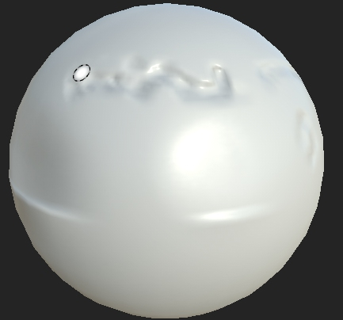    

#### 测试spp中生产法线
+ 测试的max文件   
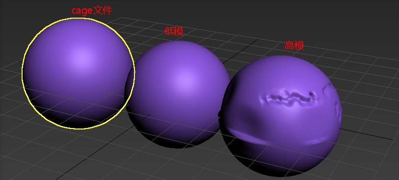     
+ 烘焙的过程， 参数全部默认， 只是加入了cage 相关的操作 。
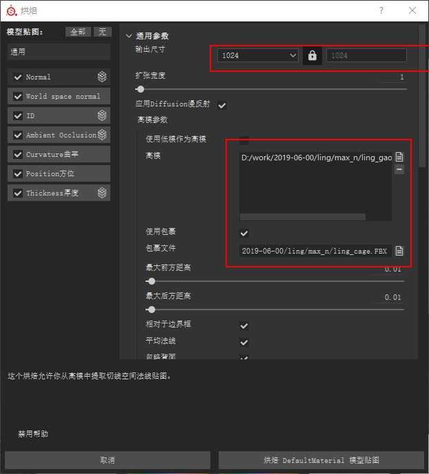     
+ 官方说明  
&emsp;按照官方的说明，在起初设置法线格式 是有些区别的， 虚幻使用的是 dx 格式，并说明勾选上 从新计算切线， 对于unity 使用的是 opengl格式， 不需要勾选
      
 &emsp; 默认使用的是dx格式 spp中直接烘焙 如图   
 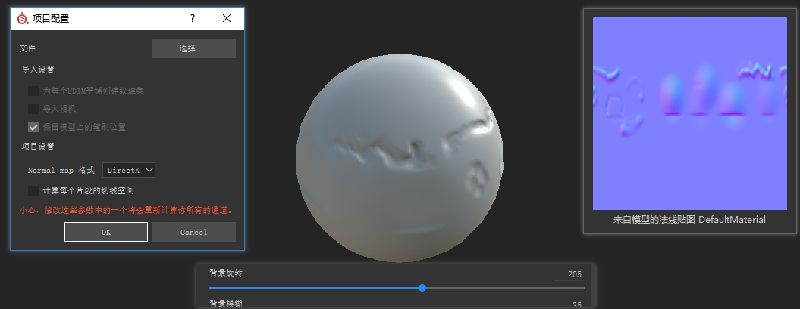   
 &emsp; 按照 官方说明 使用opengl 来处理一次  
 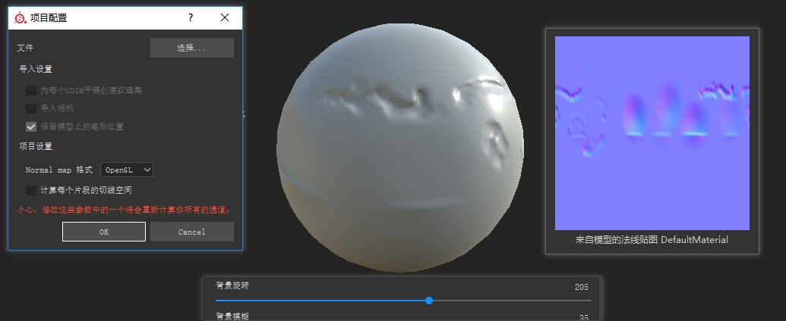   

+ 测试spp 自己烘焙过程，使用 opengl dx 似乎看不到变化  
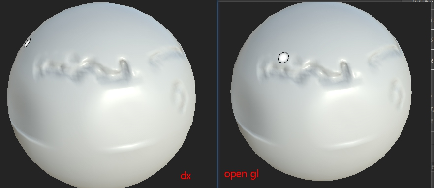    
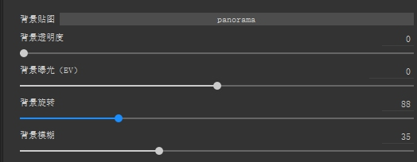    
+ 比较一下两个法线 r g 通道     
&emsp; 看裂缝部分，由于裂缝 是凹下去的，第一张图 dx是从下往上照，由于凹 开始是投影， 后部分受到光照。    
&emsp; 第二张图 也是看裂缝部分， 光照从上往下照， 裂缝凹 开始投影， 后面是光照   
 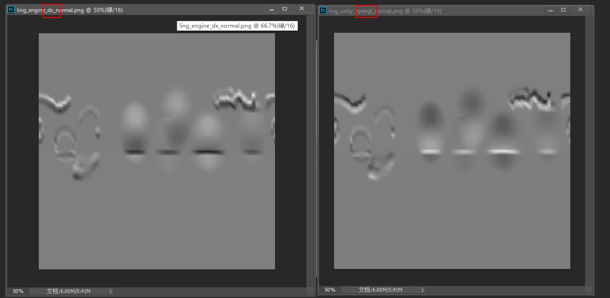 

