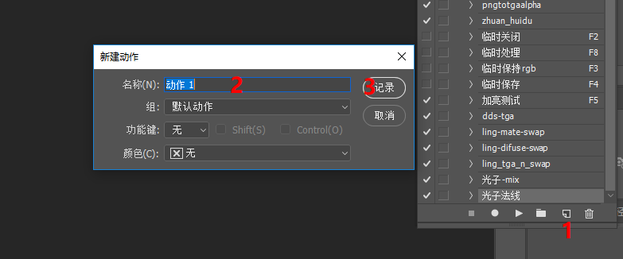
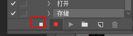
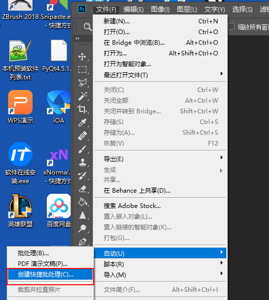
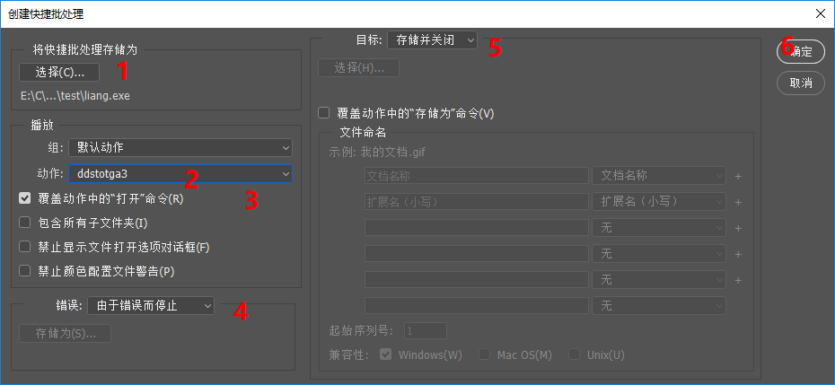
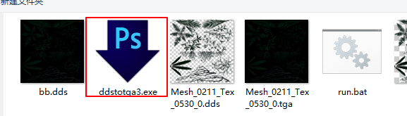
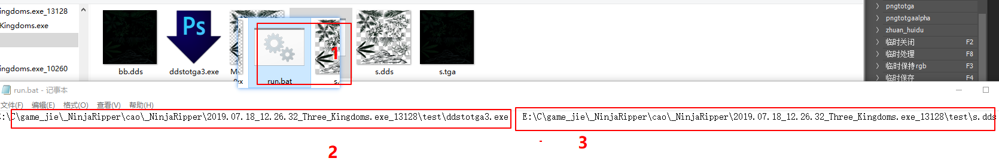
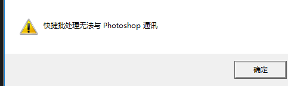
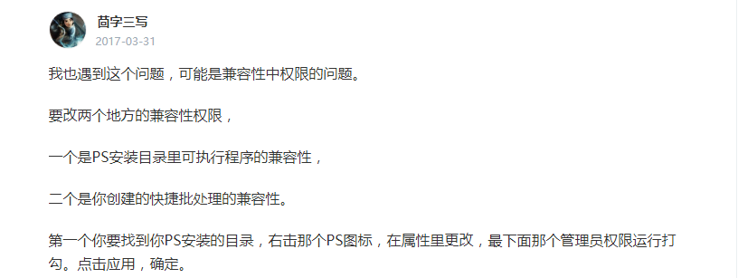
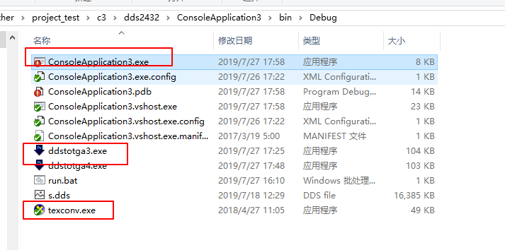

## 说明 
&emsp; ps 操作可以被记录成宏， 可以每次点击一下， 顺序执行操作步骤比单独的写脚本要来的方便和爽快,
本次操作是对dds图片进行转换操作 ，由于ps 中不知道 dds开的是几个通道， 所以，具体操作是先利用 c# 语言 调用，Texconv.exe  
工具完成 。 

&emsp;注意 texconv.exe 有自己命令格式，不能有中文，所以如果转换一个带有中文的路径， 最好做法是 利用拷贝命令，把要处理的图片转换到指定目录，通过收集反馈开判断，是多少位图，在通过ps 命令进行调用转换 **对于图像处理一律都是ps中进行**。    
>*下面是处理方法**    
>   using System;    
>   using System.Collections.Generic;    
>   using System.Linq;    
>   using System.Text;    
>   using System.Threading.Tasks;    
>   using System.IO;    
>   using System.Text.RegularExpressions;    
>   using System.Diagnostics;    
>       /// 
    
>       /// / 该方法是通过传入的dss 来判断是 24 32 位 如果是0 就错的      
>       /// 利用 显卡格式转换     
>       /// 
    
>       /// <param name="files">原始文件dds文件要求不能有中文路径</param>    
>       /// <param name="oust">转换后文件路径 </param>    
>       /// <returns></returns>    
>       public  int  dds_to_tga  (string files , string oust)    
>       {    
>           string[] dds24_32 = { "R8G8B8" , "A8R8G8B8"  };     
>           int[] dds = {24 , 32 , 0  };     
>           string exe = @"texconv.exe";    
>           string bat = (exe + " -ft TGA  -w 20 -h 20  " +  files + "  -o  " + oust);    
>           Process process = new Process();//创建进程对象      
>           ProcessStartInfo startInfo = new ProcessStartInfo();    
>           startInfo.FileName = "cmd.exe";//设定需要执行的命令      
>           startInfo.Arguments = "/C " + bat;//“/C”表示执行完命令后马上退出      
>           startInfo.UseShellExecute = false;//不使用系统外壳程序启动     
>           startInfo.RedirectStandardInput = false;//不重定向输入      
>           startInfo.RedirectStandardOutput = true; //重定向输出      
>           startInfo.CreateNoWindow = true;//不创建窗口      
>           process.StartInfo = startInfo;    
>           process.Start();    
>          string  output = process.StandardOutput.ReadToEnd();//读取进程的输出     
>           string[] c = output.Split(new char[] {' ' });    
>           int ai =  0 ;     
>          foreach  (var i in c )    
>           {    
>               if (i == dds24_32[0])    
>               {    
>                   ai =  dds[0];    
>                   break;     
>               } else if  ( i == dds24_32[1])    
>               {    
>                   ai =  dds[1];    
>                   break;     
>               }else    
>               {    
>                   ai =  dds[2];     
>               }    
>           }    
>           return ai;     
>      }     

 
****
#### 先说明一下具体生产步骤   
 + 首先建立一个宏， 名称叫ddstotga3  
     
 1.任何操作前先建立一个动作文件，这里 
 2.在命名上由于我是把dds3通道转成tga所以这里是是 ddstotga3  
 3.点击确定记录动作  
 4.下来我的操作是打开一张dds图，然后保存tga24位，名称不变，在关掉图，然后点击 

+ 生产exe文件-- 生产的exe文件我们可以利用 bat 批处理命令来处理不同的位置的图，同时也可以利用编程语言进行调用操作       
1.首先找到对应的命令    
   
2.对具体命令进行设置  
     
2-1.选择生产exe快捷方式的位置这里需要 命名和创建时候动作名称一样就可以   
2-2.在动作中选择，上面生产的动作名称 
2-3.勾选
2-4.选择错误类型
2-5.最后选择处理完成储存并关闭
2-6.点击确定  
最后生产批处理文件      

+ 批处理说明  
1.管用ps 所有可以制作成动作的文件都可以这样制作     

#### 正常情况下使用 
+ 可以利用批处理形式给 exe 传数值这样就可以处理各种文件    
    
1.正常使用创建一个文件，文件后缀修改成.bat 格式    
2.在文本中编写，**注意"\\" 的方向** 第一段是exe所在位置    
3.后面要转换的图的位置，最后转换完成，会在原图位置生产一个转换好的tga    
4.保存双击bat (需要提前打开 photoshop ，不然会很慢) 就可以看到处理后结果   

#### 问题说明   
+ 实际测试中，会出现运行bat  弹出    
+ 我参考了这里
    

 我最终解决方法，首先是 ps 2018 在win10上 ，首先按照说明处理，确认可以， 但是会出现一个奇怪，直接拖拽图片到ps 界面没有了反应， 我的做法是勾选上运行一次成功以后在 把勾选的管理员去掉， 就可以了，
在复杂情况没有遇到过    

#### 流程化 
+ bat 可以运行，在脚本工具中就可以调用，可以利用 上面c# 计算出来是 24 32位来 对应生产 两个exe 完成贴图转换    
+ 通过调整代码完成转换操作 ，首先是把转换成 3 4 通道的exe拷贝到程序运行的同目录中
    

>    public  void  runexe( int d2432 , string absmappath   )
>{
>    >string d24 = "ddstotga3.exe";
>    >string d32 = "ddstotga4.exe";
>    >string bat = "";
>    >if (d2432 ==24)
>    >{
>    >    bat += d24 + "  " + absmappath; 
>>
>    >}else if (d2432 ==32)
>    >{
>    >    bat += d32 + "  " + absmappath; 
>>
>    >}
>        
>    Process process = new Process();//创建进程对象  
>    ProcessStartInfo startInfo = new ProcessStartInfo();
>    startInfo.FileName = "cmd.exe";//设定需要执行的命令  
>    startInfo.Arguments = "/C " + bat;//“/C”表示执行完命令后马上退出  
>    startInfo.UseShellExecute = false;//不使用系统外壳程序启动 
>    startInfo.RedirectStandardInput = false;//不重定向输入  
>    startInfo.RedirectStandardOutput = true; //重定向输出  
>    startInfo.CreateNoWindow = true;//不创建窗口  
>    process.StartInfo = startInfo;
>    process.Start();
>}

+ 在上面代码中 传入了一个通告 转换工具判断是32位还是24图开完成 bat 配置 ，下面一段就是在c#中运行bat处理方式  
 
+ 运行下面代码  ===ok 
>string files =  @"E:\C\game_jie\_NinjaRipper\cao\_NinjaRipper\2019.07.18_12.26.32_Three_Kingdoms.exe_13128\test\Mesh_0211_Tex_0530_0.dds";
>string oust = @"E:\C\game_jie\_NinjaRipper\cao\_NinjaRipper\2019.07.18_12.26.32_Three_Kingdoms.exe_13128\test";
>Program ib = new Program();
>int c  = ib.dds_to_tga(files , oust);
>ib.runexe(c, files); 

由于dds转换不能支持中文目录，需要把要转换图像 需要放到英文目录下，然后转换，根据返回是 24 32来 对应的执行exe 完成贴图转换      

