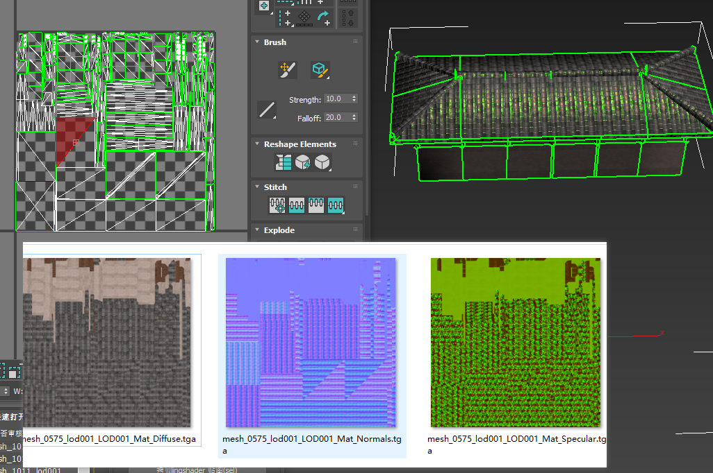

### 主要测试 合并贴图贴图是相对路径的情况    

#####  结论： 相对路径可行，如果相对路径两个 最新的那个 不是最终的 合并 有潜在问题 ，建议决定路径 
+ 测试相对路径 贴图转换通道设置成功  
      
     
+ 到simplygon 中显示正常， 不如效果不正常要确保材质球 名称不一样    
     

+ 最后合并成功   

+ 测试决对路径 ，在=simplygon中显示    合并成功
    
      
    

#### 多维材质测试合并   

+ 多维材质可以合并 
    
 

#### 合并遇到的问题 ：多房子合并 uv
 + 很多房子其实房盖是一张 basecolor noraml  mix 图 ，合并之后 
  

    

 + 上面的 uv 超过了 0-1 空间 如按照 simplygon 处理方式， 对uv 和地图进行插曲进行缩放， 处理   
  
 + 其实这种情况最好的合并就是，合并比较困难 ; 去掉title 后显示会有很大问题，
   
+ 在合并中只是把uv 对应的像素放到一起 
 

+ 开不开uv重叠没有作用 
 
   

 