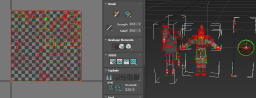

### 主要测试 合并贴图贴图是相对路径的情况    

#####  结论： 相对路径可行，如果相对路径两个 最新的那个 不是最终的 合并 有潜在问题 ，建议决定路径 
+ 测试相对路径 贴图转换通道设置成功  
      
     
+ 到simplygon 中显示正常， 不如效果不正常要确保材质球 名称不一样    
     

+ 最后合并成功   

+ 测试决对路径 ，在=simplygon中显示    合并成功
    
      
    

 

   
   

 