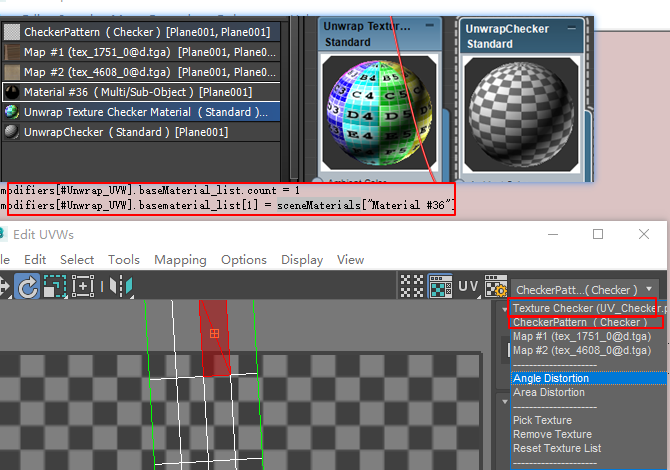
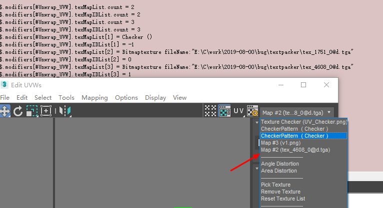
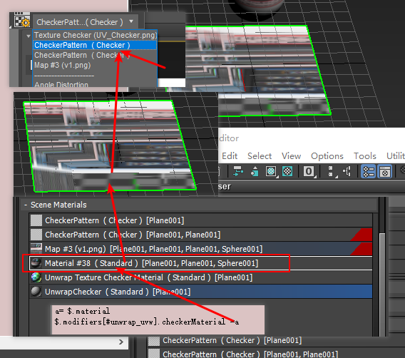

####  uvw 展开uv 功能测试   

##### 为什么要系统测试  
+  只要是在做组件贴图自动合并， 组件合并利用，贴图合并好了以后，根据具体合并的贴图情况来来反操作uv 进行缩放和偏移造成 ，
+ 针对空间最优化多了一个旋转操作   

+ basematetial   可以get 和set 一个材质没有发现作用  
+ basematetial_list  其实是uv 显示的材质材质， 比如显示棋盘格 其实是系统创建了一个棋盘格材质，显示  
   
+  texmaplist  texMapIDList   也是在列表宏显示的图情况 可以利用picktext 实现    

+ checkerMaterial    默认是生成棋盘格的材质，这里是uv 窗口操作自动生成，所以需要独立处理   
   

+ vertexSnap 顶点快照的开启和关闭这里处理 
+ edgeSnap GridSnap  都没有找到使用的地方 
+ 
