#### 分析全战地表 
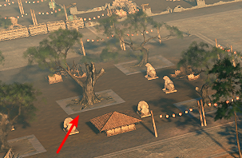 
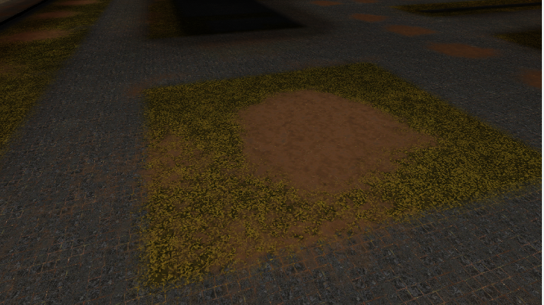     
+ 地表和模型衔接    
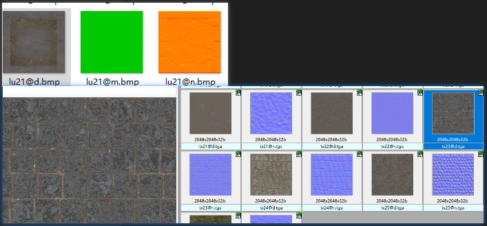  
+ 地表是 地形mesh 贴图两种 一个basecolor rgb a 是高度图 一张是法线，a是粗糙度    
+ 利用模型覆盖  分三张图 base mix  normal   
+   

###### 广陵城地表     
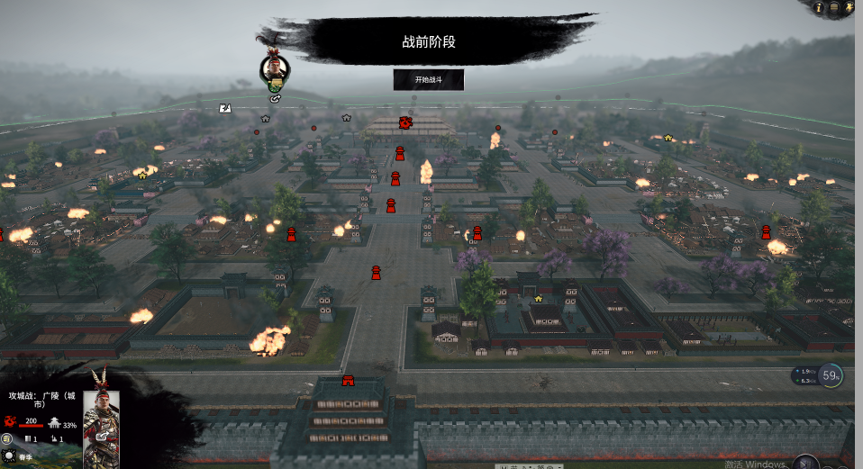   
+ 绘制过程  
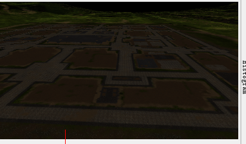 
+ 地表贴图   
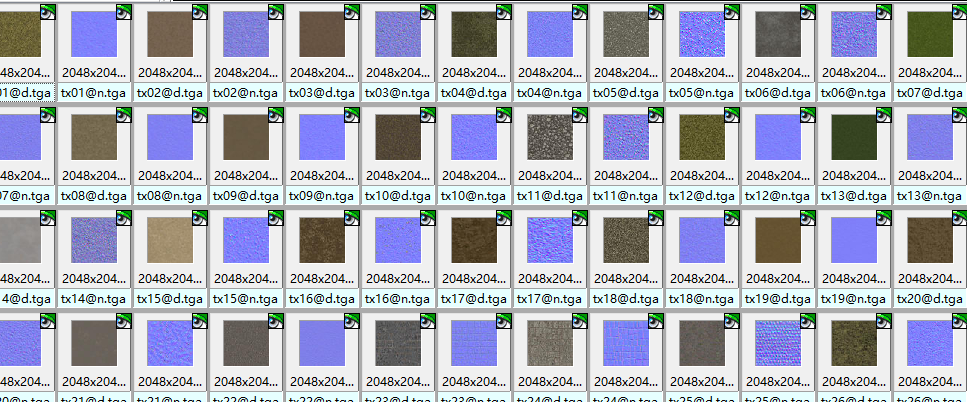  

+ 树木周边处理   
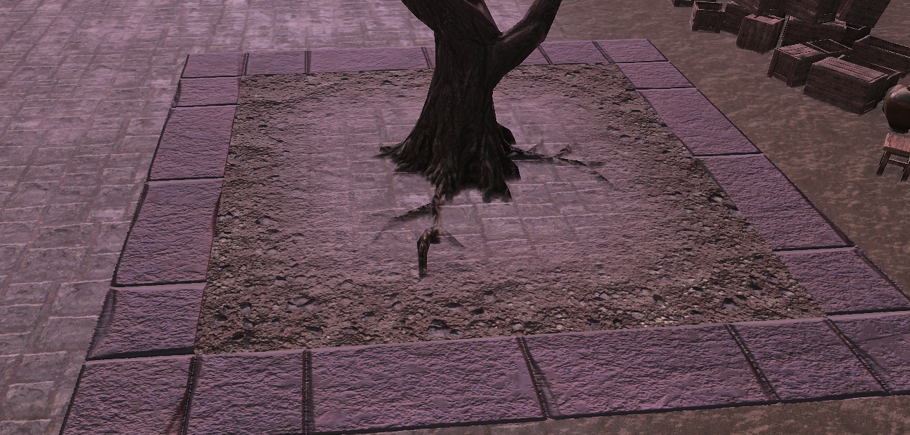
 

+ 这些是两层，应该是贴化， 一点都不闪烁   

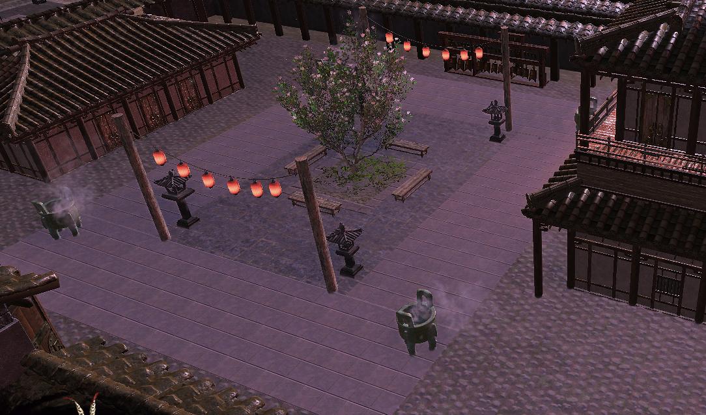   
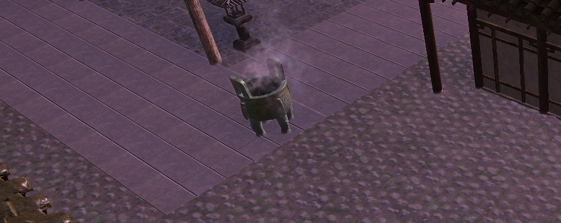  

+ 车辙  3-4张 贴图 
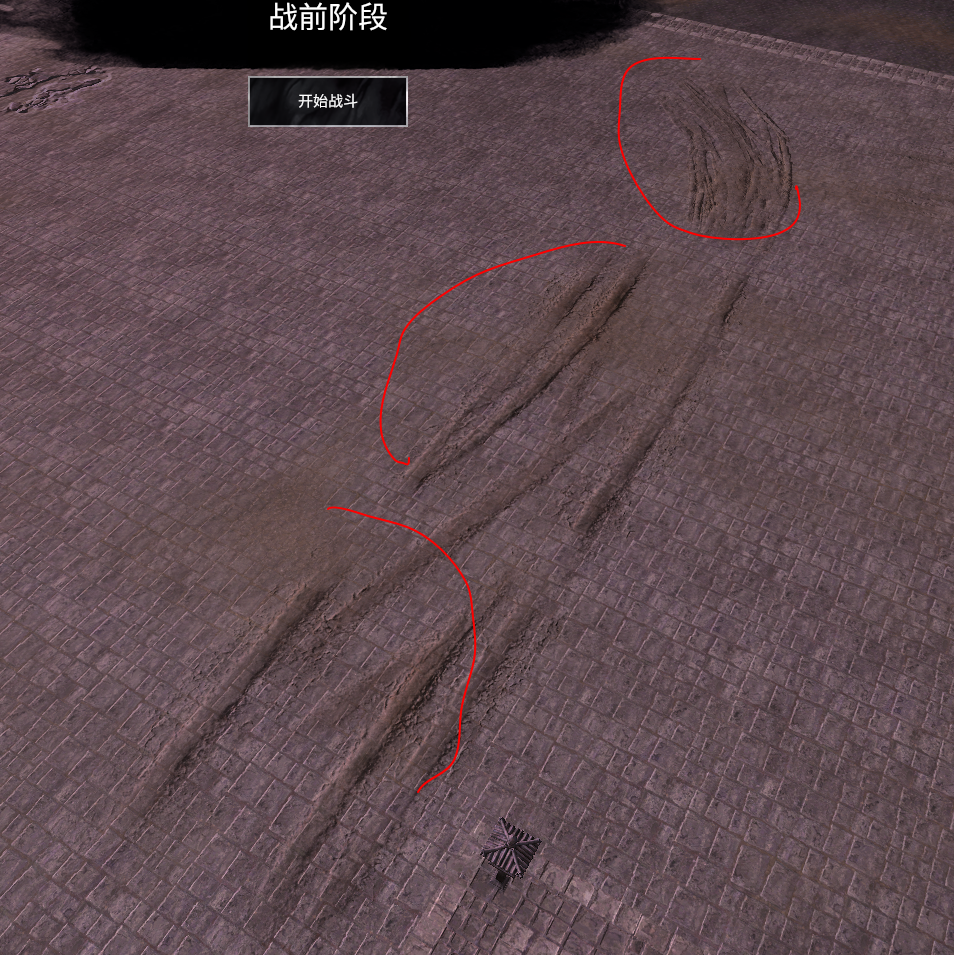  

#### 城内贴图使用   
 
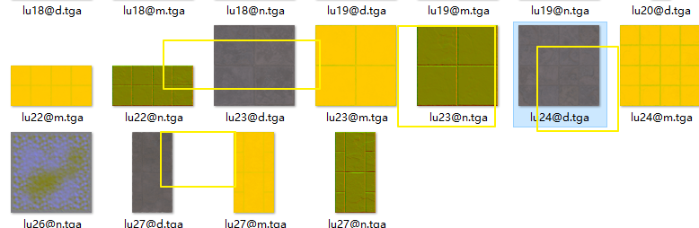  

