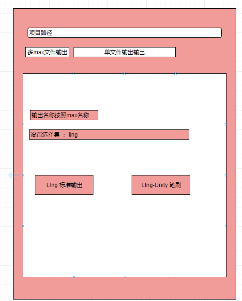
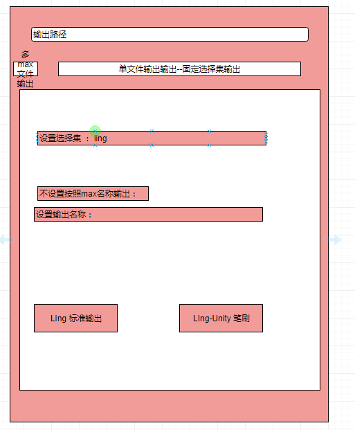
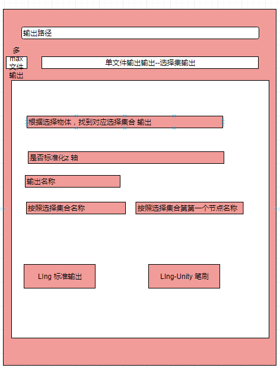
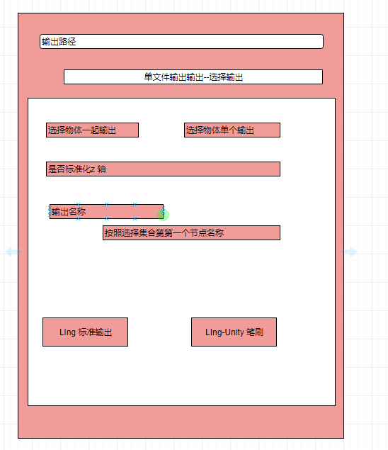
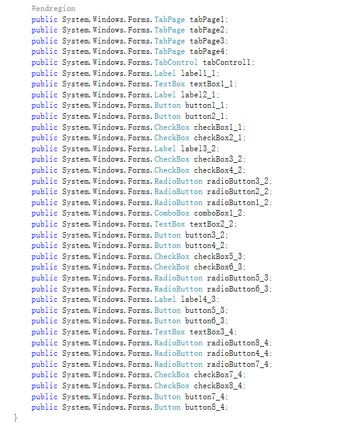

## 模型导出迭代      

#### 现在来看 导出4中情况   
+ 第一种是 多max文件导出   
     
+  单文件标准输出    
     
+ 单文件 多选择集合输出    
    

+ 单文件多节点输出  选择武器一起输出   
      

##### 由于max 直接使用dotnet 有很多问题，现在实际利用c# 值界面， 制作城类库 然后通过 ms 来制作事件    

