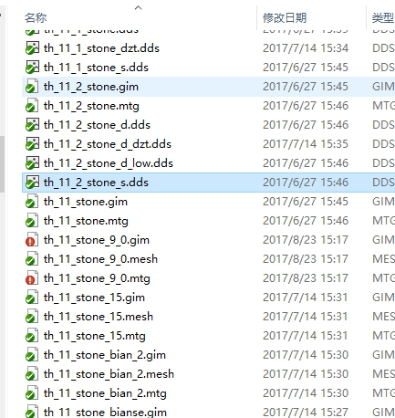
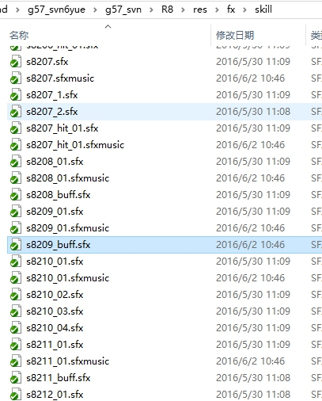
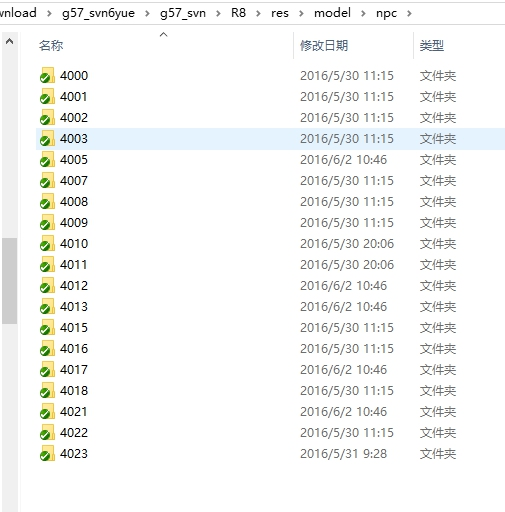

# 工程命名 
### 查了一下怎么处理的都有 

 + 以上都是各种命名规则 ，现在来看 其实效果并不好 
 + 各种情况都有 

### 现在 Ling 的处理 -- 角色 场景 特效 ui 
1. 模型贴图基本命名规程
    +   “u”+"级别"+[_部件名称] 
    +  [] 之内的资源可有可无

2. 角色
   1.      

3. 场景
   1. 静态 

   2. 动态建造

4. 特效

5. ui 

6. 对于特效 资源        