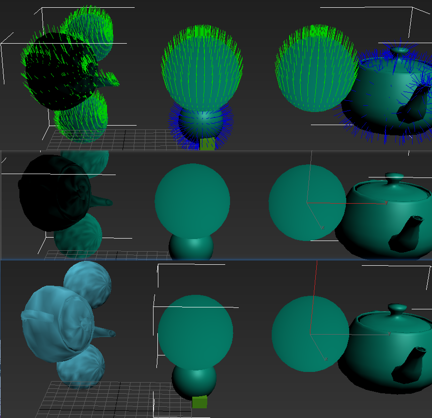
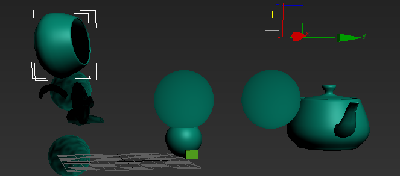
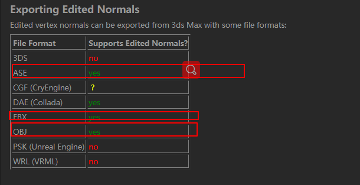
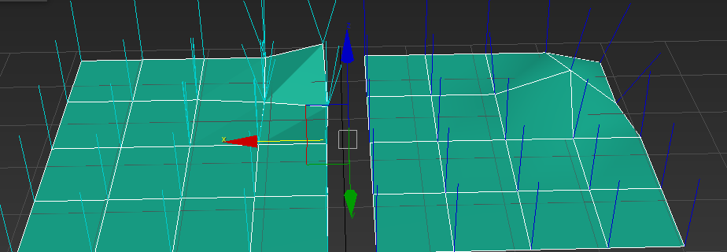
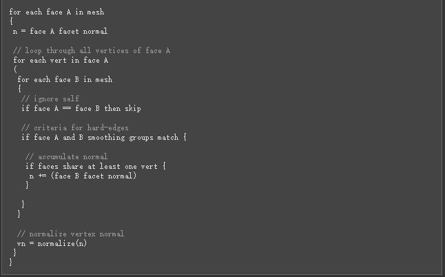
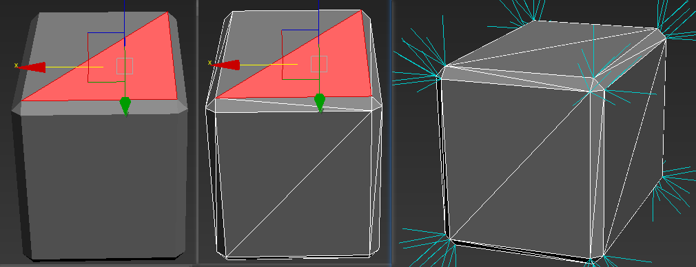

## 顶点法线影响树木数据 影响烘焙 最后效果    

+ 软硬法线是设置的 理解成美术操作的光滑组   
    
  
+ 这里有说明制作max中的弊端    
[顶点法线说明](http://wiki.polycount.com/wiki/VertexNormal#SetNormals_MAXScript) 
+ 说明：
  + 本身max本身编辑uv 功能很差 
  + mesh 合并会丢失光滑组和 法线信息， mesh 每次合并都会重置 
  + poly 可以做到合并不丢失 光滑组和法线 ，以为这不更新 
  + 多个mesh 做合并 最好保证法线方法需要给每个节点加入editnormal  
  + 加入了旋转的模型需要给模型加入 xform 线确定在进行处理   
      

  + 如果 detach 模型 ，detach的模型将会法线重置， 也就是说只能合并或者说记录下编辑法线信息            
  + 新版本 detach 模型到一个新元素 法线 法线是正确的，不会出现问题     

+ max中编辑了法线，并不是所有格式都可以导出， 有些格式是不能 导出的   
      

+   说明：对于之前基于点链接点点的法线处理工具合理操作需要在poly层面，处理       

+ 从这里导出了很多网页 本质都是处理法线， 影响烘焙 影响光照 最后影响效果   
 
工具网页链接 
[工具](http://www.scriptspot.com/3ds-max/scripts/noors-normal-thief)   
  [原理展示](https://polycount.com/discussion/comment/2230470#Comment_2230470)   
  [一些顶点法线代码](http://www.bytehazard.com/articles/vertnorm.html)  
 
 现阶段先片段方式写，最后比较后 比较过程 写出来，通过烘焙效果处理 
 然后工具化处理     

+ 法线处理 一般对于造型有作用， 本文主要是对于树这种 不规则的 多多边形的处理方式，
+ http://www.bytehazard.com/articles/wnormals.html  引出本文 

+ 这里说到了模型建造的硬边和软边的问题 ， 
  硬边： 一个模型每个三角性有独立的点法线 
  
硬边和软边模型 在平面状态下，由于法线重复在一起比较难法线， 当造型一有变化时候， 就可以法线知道，硬边就是每个三角形点有独立法线    

+ 应变模型合并成软边的一般做法 这里有说明     
    
我解释一下：   
&emsp;&emsp; 面A 在模型中循环 知道面a 的法线n， 点在面a 中循环 mesh 每个面3个点， 面b 在模型再次循环模型，两个面相等过， a b 如果在光滑组匹配  ，面和和不有一个点链接 法线n加全b的法线
最后在把n 标准化，设置给 顶点的法线 
+ 一般来说 测试一个简单模型 光滑组都是一个， 这测试就简化不处理   
+ 测试案例，通过加入edit normal 加入法线 
 

