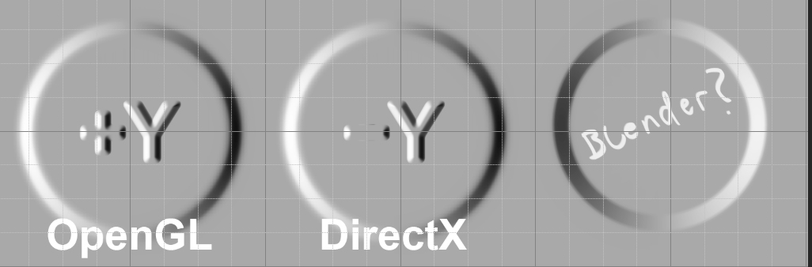

## 法线 说明
###   **spp 默认法线是DX类型**

###  max 默认是右手坐标系，支持平台是dx平台，我们引擎也是 右手坐标系， 但是不代表 我们的法线就是dx格式法线， 这些完全看 平台和shader 写法 
+ 法线类型

  +  我们引擎使用右手坐标系
  +  我们引擎使用法线是openGL格式
  
+ openGl  Directx 法线 r通道光照从左到右  
  
+ openGl  法线 G通道 光照从上到下，DirectX 法线G通道光照从下到上 

## Ling引擎 是右手坐标系 (同max maya 一样 ) 法线使用的是 OpenGl 格式。

