### 测试自动展开2uv工具     

####  测试趣向平面复杂模型情况   
+ 设置对的光滑组  
+ 模型完整没有断面     
+ 对于解包模型 一般会跟进1uv分割模型也会断开   

+ 要测试的模型   
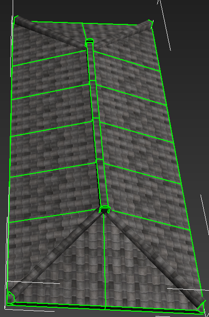    

+ 1 uv 情况  
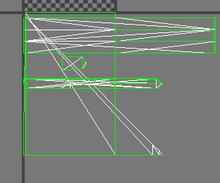   
+ 如果模型不缝合 使用工具处理2uv是这种  (碎了)    
   

+ 缝合模型后 2uv 默认情况    
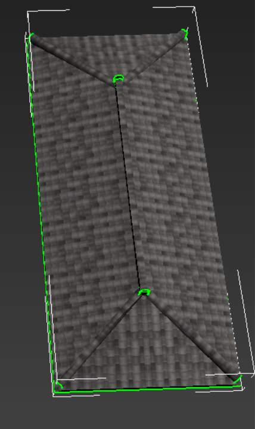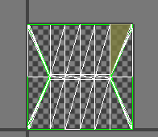      

+ 再次工具处理2uv   
 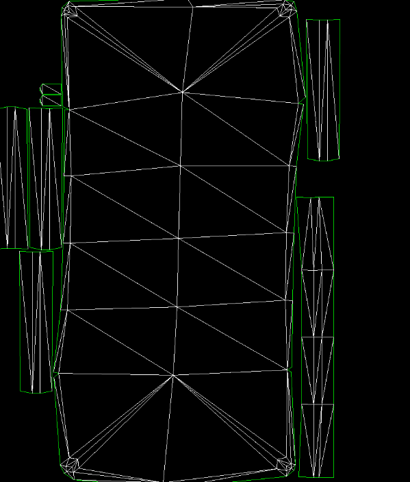  

+ 开启高质量     
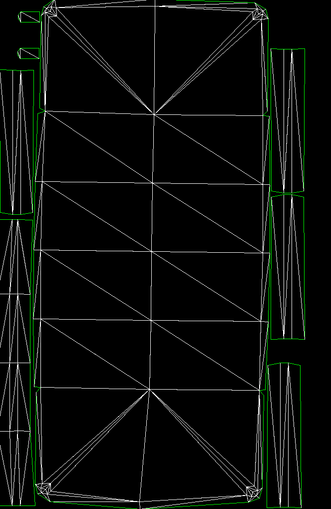   
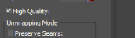     

#### 测试趋向圆柱的复杂模型
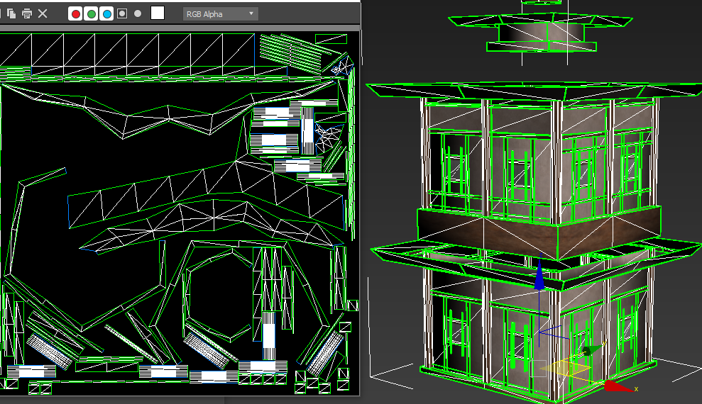    
 一般来说默认配置够用    
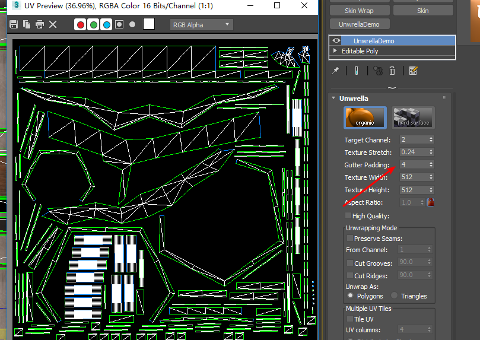  

#### 测试不规则多表型   
+ 模型有接缝没有缝合    
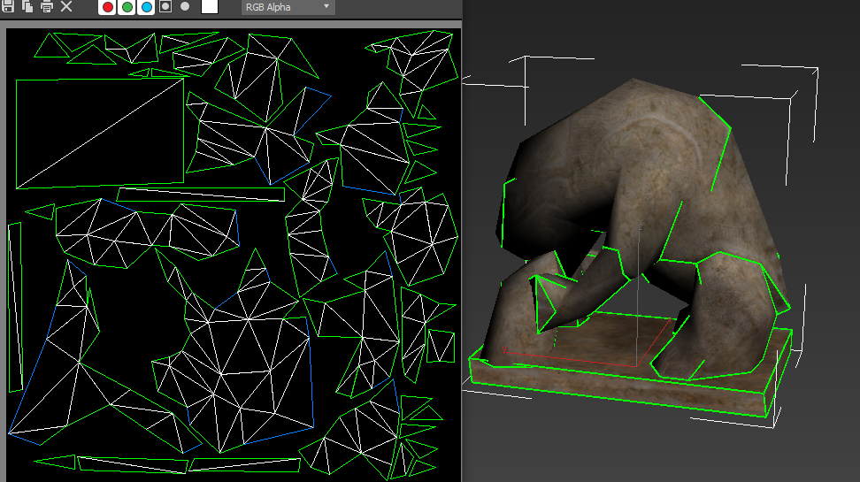  
+ 模型处理好接缝    
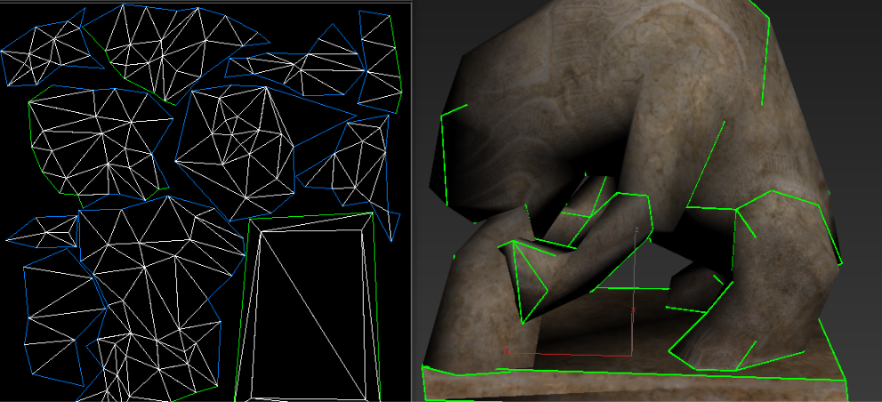   
+ 不规则多边形  
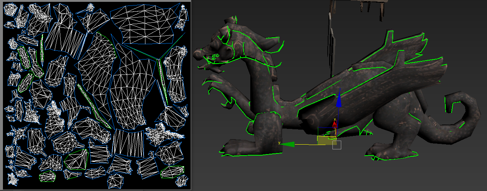   
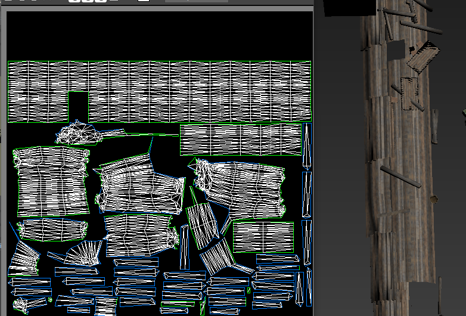    

****
****
#### 还可以从通道继承    
+ 本身物体分割uv 不合理  
  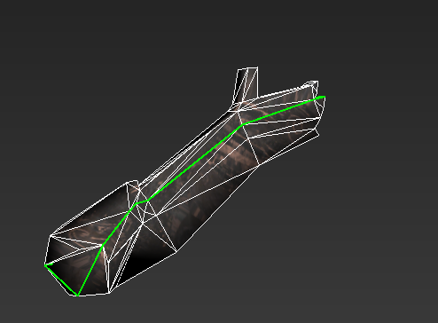    

+ 利用max自己修改器分割uv    
 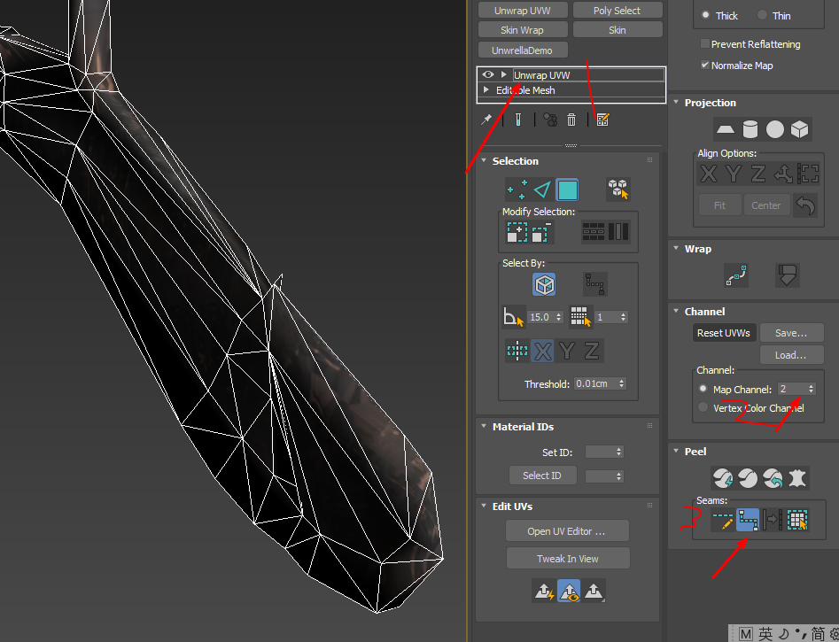   
 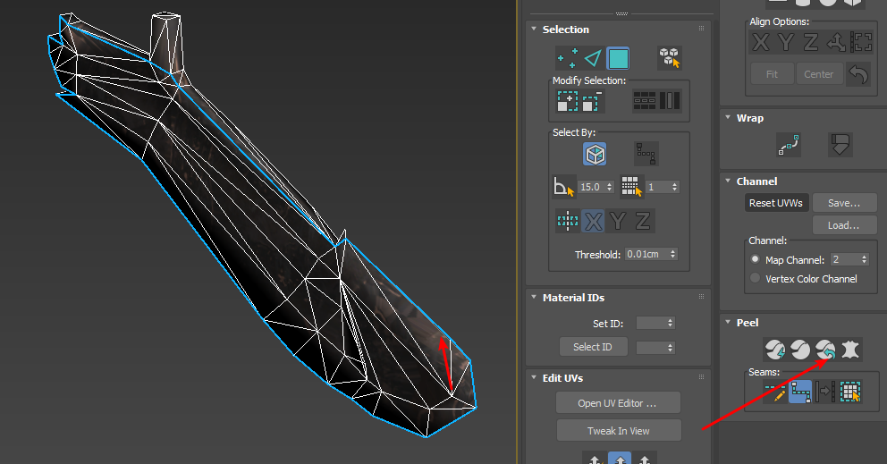  
   
+ 从从到继承然后展开 (unw)  
 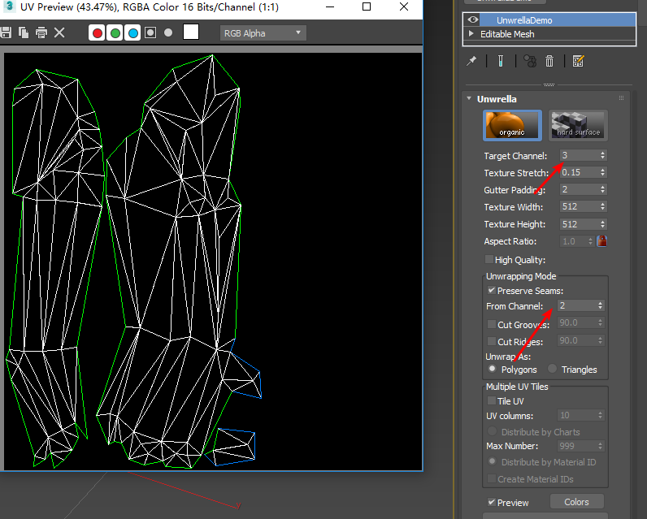   

+ 和max对比 max展开没有考虑uv重叠问题，如果处理lightmap 会有问题  
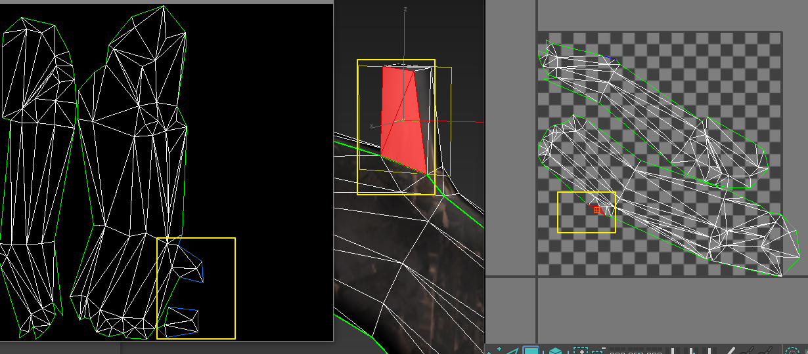   

**** 
#### 支持脚本可以批处理    
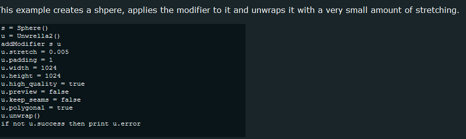 