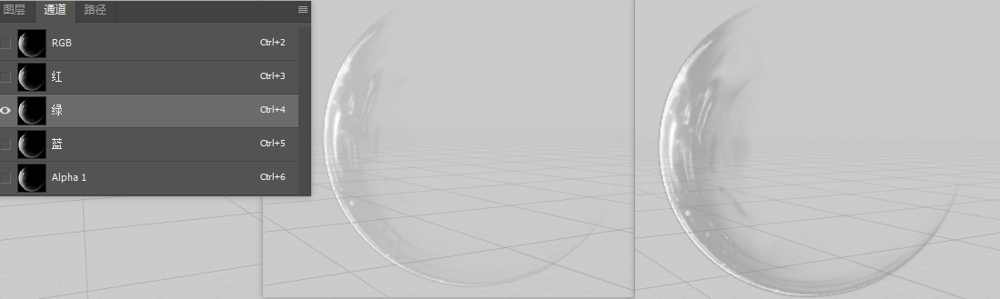
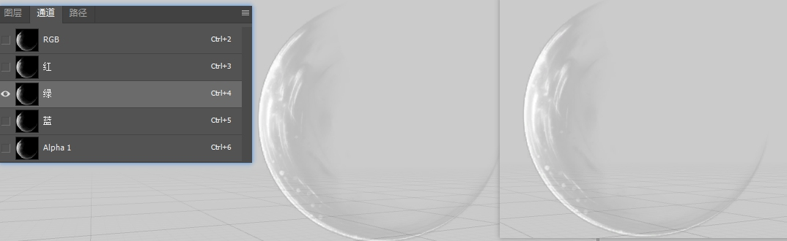
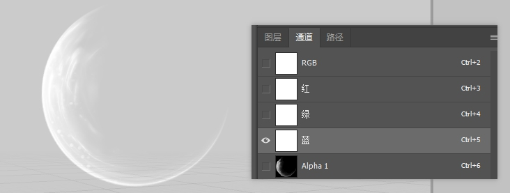
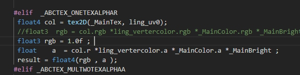
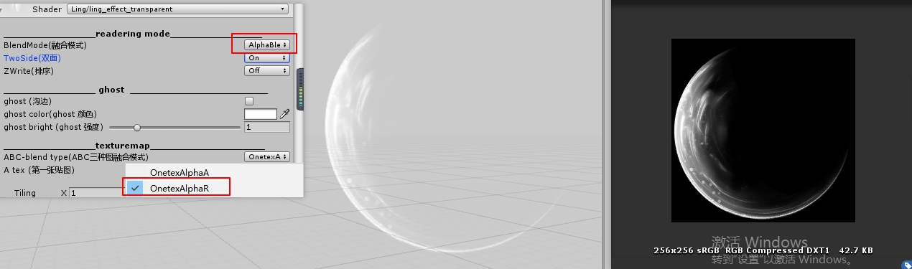
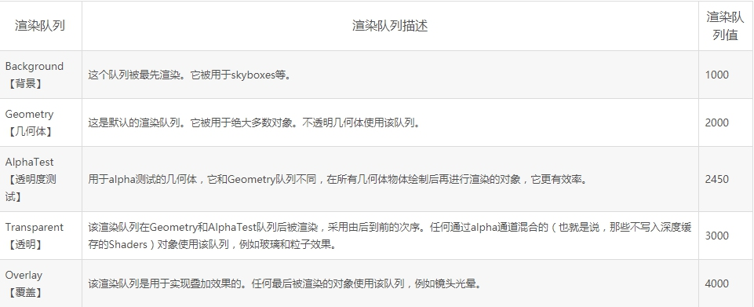
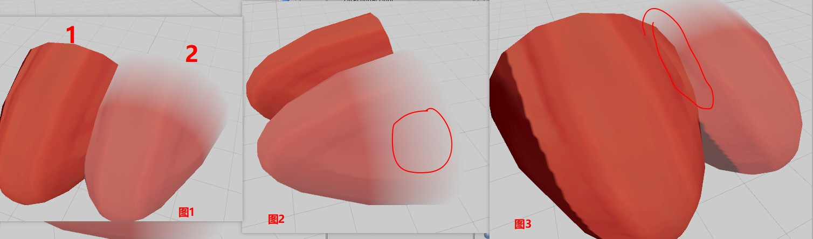
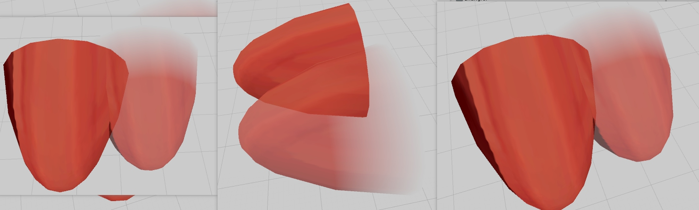

# 特效一些问题

#### 线性模式

##### 1.a 和r 通道问题 
+ 特效贴图 rgba 数据一样， 但是实际特效显示效果不一样， 原因是 特效贴图的 rgb 通常会使用 srgb模式， 而对于a通道还是使用线性模式。
  + 使用r作为透明进行特效渲染和使用a通道进行渲染   
    &emsp; rgb 一般会人物是美术绘制图形，直接在伽马空间进行，而a 通道反应的是一个线性关系    
    &emsp;  第一效果是r 第二效果是a 由于使用srgb 会乘以伽马系数，导致透明的多
     
  + 修改特效贴图为srgb 空间为线性空间   
    &emsp; 效果一样，但是一般来说 特效贴图都是使用 srgb模式，a会线性存在 ，在线性模式下，正式这个问题就可以， 知道 a 和r 区别下，来制作特效。  
   
   
##### blend模式下黑问题 
+ 正常情况 使用blend 情况下 就是 srcAlpha  OneMinusSrcAlpha ，渲染的图形乘以自己的a通道 然后叠加上 背景 乘以1-a通道完成blend的操作 。   
   &emsp; 
+ 对于黑白图，一般解决都是，rgb在原来亮度范围上加大加亮，使用小于一圈的a ，这样在进行上面blend时候， 渲染出来的图本身就是白色，在乘以a通道，来解决黑边问题 。   
  &emsp; 测试操作，直接把rgb 变色了白色，blend出来没有黑边问题. 
     
  &emsp;对于ling项目 要求大多数的特效图为去色模式，去掉a通道，，a通道采用自己的r通道代替，所有颜色颜色通过叠加进行，rgb本身采用r通道作为a通道进行blend时候，就会出现上面的黑边现象。   
  &emsp;  解决方法：在使用r通道作为a时候， rgb shader 直接使用1.0代替，解决blend 右黑边问题      
     
  &emsp; 
   修改后 rgb图，blend模式 ，直接切换成  "OneTexAlpahaR"  黑边解决   
   

##### shader Geometry队列问题 
+ unity中给出的队列关系 
    
+ **如果使用Geomotgry 队列 shader 有z深度排序， 融合模式就是 one zero**
  +  使用 blend add **效果不对，逻辑也错误**   
    
    1. 1模型 使用 Geomety 渲染队列 blend 模式 ONe zero 
    2. 2模型使用Geomety 渲染队列 blend 模式是  srcAlpha  OneMinusSrcAlpha    
    &emsp;      
    1.   图1  渲染一个错误 blend模式 模型自身有了透明处理，但是和 后面 几何体 排列奇怪 并会出现 透明    
    &emsp;    
    1.  图2 也是说明 本身blend 模式，但是排序还是按照 Geomety 处理    
    2.  图3 角度出现乱序问题  
  + **2模型修改成 Transparent 模式，逻辑正确 ，上面问题都解决**   
       

