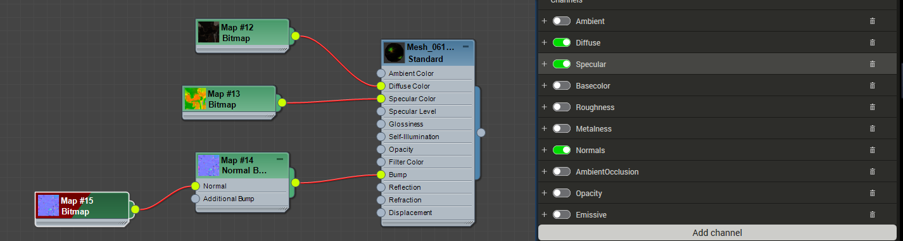

### 优化模型+合并贴图工具   

+ 模型很多id 很多贴图，  需要
  + 优化模型面，一般来说端游面动辄就是 上万  
  + 优化合并模型 模型合并贴图合并    
+ 这里处理过程设计到使用一个simplygon 工具    
+ 工具本身提供了很强大功能，减面 从新拓扑模型 优化骨骼 合并贴图等   下面看一下 处理的效果    
    
+ 工具地址[链接](https://account.simplygon.com/#docs)工具可以免费使用，但是微软会反馈使用结果 [文档](https://simplygondocs.azureedge.net/8-2htmldocs/articles/starthere/typicalinstallation.html)

### 操作合并贴图   
****   
+ 实际测试中，贴图下面这种安排 可以做到对应合并。 高光通道放mix 图，固有色放 basecolor  法线通道放法线     
     
&emsp; 这里就是uv通道设置， 测试可以做到和max 进行对应操作    。 
    
&emsp; 对于图的格式设置，颜色 输出的图片格式 通道大小进行设置，一般来说：法线使用的是法线，其他都使用颜色就可以， 
     
1.这里就是对应的合并贴图模块   
2.设置合并大小，还可以设置成auto 会自动合并，最后保证长和宽是2的次幂就好，我们选择固定大小     
3.这里选择使用原uv 处理，自动分uv 测试会分的比原uv还多，增加顶点数量     
4.这里就是uv 展开使用什么格式 ，需要测试一下    
&emsp;要合并的模型展示    
     
&emsp;按照纹理结合合并， 两个都是256 所最后效果手部占用uv太多      
     
     
&emsp; 按照表面积 合并处理， 感觉比较靠谱  
    
  
&emsp; 按照像素比     
   
   
&emsp; 按照uv size     
  
       

5.设定好uv间距 对于512 保证2的空间来计算      
6.设定好对应的图     

###  合并图结论  
**** 
+ max中到simplgon过程中， 支持5中通道贴图合并 
  
+ 在每个通道有 **color** **normal**  **ao**  **opactity**  通道可选，经过测试我们只会使用到 color  srgb 模式   normal 切线模式  靠谱。  
### 合并测试   
   
   
      
+ 合并注意坑    ,要处理好第一个--合并uv ，此时可以下不合并模型，方便分开减面处理， 之后统一合并     
   
+ 测试多维材质支持， 但是对于dds很多时候支持不好    
     
 
### 基本操作 
1. 按照上面分别指定  固有色 高光 法线通道  给 basecolor   mix  normal  

2. simplygon 安装好以后，会自动拷贝插件到到max2018 中， 打开可以看到   

3. 选择设置好的模型 点击 等待工具链接   

4. 点击 进入软件就可以了    
   
5. 注意如果只是合并贴图，只是需要开启合并贴图这一项 
 &emsp;1.点击贴图图标  
 &emsp;2.这里就是通道设置了，具体设置参照上面说明  
&emsp;3.点击开始运行 
  
6. 处理完成标志 --- 会有一个绿条 点击一下加载到场景中      
 
7. 点击返回max 按钮    
   
8. 新模型 会调整，注意输出合并模型可以是很多物体，这里只是测试了一个物体，处理好的模型会使用lod 后缀表示     
 
9. 合并贴图默认这里 找到整理就可以了       

