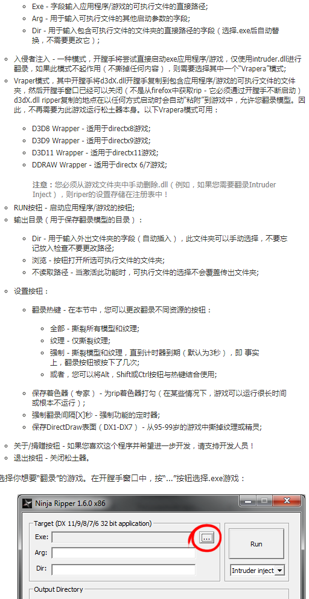
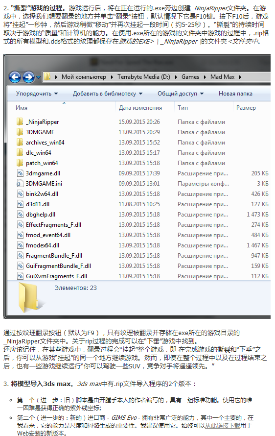
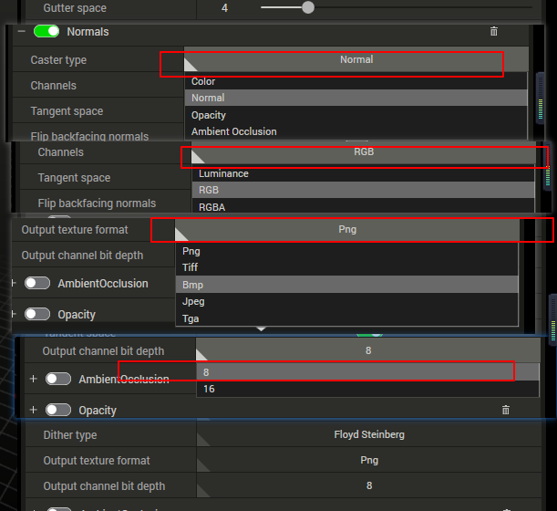
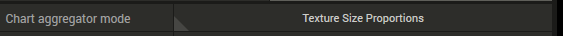
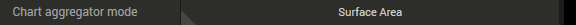
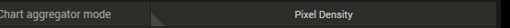
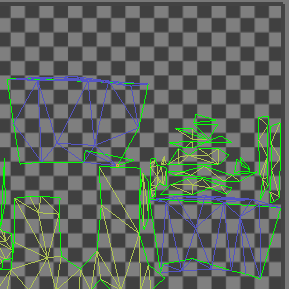
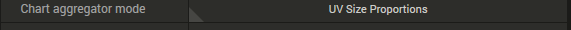
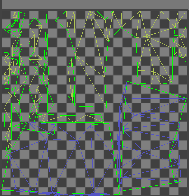
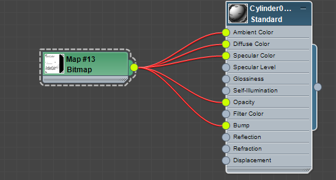

[ToC]
##  说明   
****
+  在这个文档里面会说明从解除游戏资源到 最后减面合并贴图全过程，过重中使用 一些max脚本工具和各种软件插件     

### 首先是从游戏中解资源   
+ 使用的工具是    ninjaripper1.7.1_with_new_script   [工具网址链接](http://cgig.ru/ninjaripper/)     
+ 有完整的教程说明，是俄文， 可以利用google 翻译来看，针对网络不方便同学 ，先是截图，基本上 看了下面截图文件就会操作了   。
    
     
    
   
   
   

+ 相信上图看完了，基本会操作了，run 运行游戏后，想要那一帧数据 ，是要按下 抓图会计键，等等，数据就会出来    
    
&emsp;输出目录可以设置到一个容量比较大的盘， 实际测试抓一帧 全面战争数据要1G多， 非常大 。 另外，我系统是win10 了使用的工具都是64为的，如果是32为的需要开启 对应的32位的，exe      
&emsp;   点击 “run” 等游戏启动，按下抓快捷键就搞定数据抓取 。     
      
&emsp; 数据格式分两种， rip数据模型 uv  法线 等信息， dds对应的贴图，  由于我本地不方便查看， 可以利用 ps 批量转换成tga  方便浏览器查看    
+   补充说：实际测试，上面说的推荐使用的max 插件 安装 max2014 可用， 但是到2018 不可用，但是脚本通用，实际测试推荐使用 脚本 --->       
+ 就像是文档中说的一样，导入最难确定的就是就是 uv数据定位， 为此 我专门迭代了该工具     
    
&emsp; 可利用一段一段导入数据，确定先要的模型在什么编号上，  然后在导入一个  利用uv枚举功能，判断出出来 uv 是多少 。  
&emsp; 首先这里可以方uv 索引，建议5或者10个数据一个档  然后点击    会枚举出来所有模型，注意注意注意 按钮描述 一定是  .   
&emsp; 其次点击 看到 可以一次 枚举查看uv正确性，  uv表示在模型名称 最后标注可以看到，一段数据一段数据枚举， 都不是的话，点击 删除模型 然后 在枚举下一轮数据， 数据从 3 -50 可以快速找到模型 uv     

+ 到这里数据完成并加载到了max 中      
     

### 优化模型    
+ 模型很多id 很多贴图，  需要
  + 优化模型面，一般来说端游面动辄就是 上万  
  + 优化合并模型 模型合并贴图合并    
+ 这里处理过程设计到使用一个simplygon 工具    
+ 工具本身提供了很强大功能，减面 从新拓扑模型 优化骨骼 合并贴图等   下面看一下 处理的效果    
    
+ 工具地址[链接](https://account.simplygon.com/#docs)工具可以免费使用，但是微软会反馈使用结果 [文档](https://simplygondocs.azureedge.net/8-2htmldocs/articles/starthere/typicalinstallation.html)针对不方便同学，这里截图一些片段针对有网络限制的同学，记得要设置代理     
+ 下面20张图，都是从官方翻译截图， 我们具体操作，会使用到里面一些技术   
    
     
    
   
   
   
    
 
 
 

#### 操作减面   
+ 首先是减面，模型1.4W 修改成1.5k 还要可以动画，基本细节保留 ，下面开始具体操作   
    
+ 首先要给模型绑定好骨骼， 这个就是位了工具动画关节来优化线条 (模型快速绑定可以找一些现成的模型利用 skinway 方式解决)    
     
  + 1.找一个已经skin好的模型在体型模式下，调整成要减面模型的pos   
  + 2.模型在帮绑定前标准化，比如位置原点，没有缩放旋转 等，加入xform修改器修正， 
  + 3.给模型加入skinwrap 修改器然后在4 位置点击原模型， 
  + 5.这里可以切换看看点和面那个好，一般都是选择面包裹，到这里蒙皮完成了90%， 剩下即使利用skin 塌陷后skin后在调整   
        

+ 绘制一些顶点色， 在关节位置，只要为了接下来，simplygon 工具识别，来完成减面操作， 之际测试，工具会对顶点色交接线的位置，细节会经可能保留， 对于顶点色轻重，是否有颜色无关           
       
+ 由于模型面比较高，一下优化到很低的面，很多造型都会出问题， 建议是对于 面部手部细节采用二次优化  。 
  +  身体可以一起优化    
     
  + 对于面部 采用二次优化， 第一次优化到 几k ，然后再次优化，利用 工具模板功能来对于 鼻子嘴巴等 进行mask ，防止 最后 嘴歪眼斜     
     
      
  + 基本操作和功能可以通过上面文档知道有什么功能， 通过这里[链接](https://gameinstitute.qq.com/community/detail/112883) [链接](http://76d378cc.wiz03.com/share/s/1SQTzc2pQABT2PLuhY3fsTlL1Kaiic3AOQpn2P2KEg0gcLII)  知道具体细节操作   
  + 我们的配置要求是， 给提起1000面 ，给面部500 的来划分，动画和顶点色都是高设置     
       
  &emsp;  减面几种 我们是需要精确减面处理，同时，我们使用在原有uv上进行处理    
  + 对于面部我们是想保留住这些细节， 所有在第一次减面时候会使用顶点色标注,注意顶点色的位置 。 
      
  + 对于面部，一次从6k见到500 效果不理想，需要二次处理，我们线减少到一个2k样子，这样大的细节会保留，然后 mask重要部位， 在减少到500    
     
  1.设置顶点色部分 
  2.设置位高级算法 ，会慢一些但是会好
  3.处置减处理到2000.作为一个中间过程 
  4.点击这个大按钮，进行  说明一下：由于我们是网络版本，总是会和服务器通讯，速度还是要取决于网络速度   
  5.完成以后会这里变色， 点击一 “下”箭头 加载优化后模型 
  6.视图中通过，通过几个对比按钮可以看到对比效果，效果确认，返回到max中。 如果效果不好，可以修改参数，多进行几次，找到ok的结果，删除不用的结果，最后在返回视图 。 
  + 操作过程   
     
  + 回到max中 整理, 同样都是 2k 最后效果大不一样， 注意顶点色分布 ,注意 工具只是会识别 顶点色边缘，知道这一点，怎么处理顶点色就知道了。 
      
    、
  + 在2k 基础上在处理到 500 ，本次会利用他的mask 技术     
     
  1.鼠标点击不动，会弹出笔刷工具，共笔刷是一个mask 功能，是一个非黑即白的功能 ， 
  2.可以调整笔刷大小  
  3.这里操作是 出来2中颜色， 绿：shfit+鼠标左键 ，一定要留下的结构  红：shift+鼠标右键 ，会去掉解结构颜色，  shift+中键 清空   
    
  1.这个时候我们才处理成500 
  2.一定勾选上"User Weights " 这样我们设置的mask 才有用， 其他设置和之前一样,对于顶点色 和mask 蒙版，怎么化比较好，一定多多测试。     
     
     
         
### 操作合并贴图   
****
+ 说明：关于合并贴图部分，我之前专门写过类工具 基本思路是调用max的 烘焙uv功能， 来实现操作， 动画 静态模型都可以操作， 但是接触了 sinplgon ，发现他功能更强大，原来工具链接[【文档】模型 uv 合并 优化文档.xlsx](https://github.com/pyclyy/project_test/blob/master/%E8%A7%A3%E6%B8%B8%E6%88%8F-%E5%AF%BC%E6%A8%A1%E5%9E%8B-%E7%BB%91%E5%AE%9A-%E4%BC%98%E5%8C%96%E9%9D%A2-%E5%90%88%E5%B9%B6%E8%B4%B4%E5%9B%BE/%E3%80%90%E6%96%87%E6%A1%A3%E3%80%91%E6%A8%A1%E5%9E%8B%20uv%20%E5%90%88%E5%B9%B6%20%E4%BC%98%E5%8C%96%E6%96%87%E6%A1%A3.xlsx) 完全可以做到uv合并，效率不是很高，所以来学习一下 该工具     
+ 实际测试中，贴图下面这种安排 可以做到对应合并。 高光通道放mix 图，固有色放 basecolor  法线通道放法线     
     
&emsp; 这里就是uv通道设置， 测试可以做到和max 进行对应操作    。 
    
&emsp; 对于图的格式设置，颜色 输出的图片格式 通道大小进行设置，一般来说：法线使用的是法线，其他都使用颜色就可以， 
     
1.这里就是对应的合并贴图模块   
2.设置合并大小，还可以设置成auto 会自动合并，最后保证长和宽是2的次幂就好，我们选择固定大小     
3.这里选择使用原uv 处理，自动分uv 测试会分的比原uv还多，增加顶点数量     
4.这里就是uv 展开使用什么格式 ，需要测试一下    
&emsp;要合并的模型展示    
     
&emsp;按照纹理结合合并， 两个都是256 所最后效果手部占用uv太多      
     
     
&emsp; 按照表面积 合并处理， 感觉比较靠谱  
    
  
&emsp; 按照像素比     
   
   
&emsp; 按照uv size     
  
       

5.设定好uv间距 对于512 保证2的空间来计算      
6.设定好对应的图     

+ 还需要测试一下max中其他通道和工具通道对饮关系   
&emsp;这次要测试的要求15张贴图  都使用rgba 来完成  查看合并情况 
  + 测试1 Ambient 测试可以合并   
    
  + 测试 高光级别，不支持        
       
  + 测试 自发光， 通道不对应 合并了uv ，图都没有合成       
         
  + 测试合并 透明度 最后做透明，烘焙贴图 ，类型一定不能是透明  
       
  &emsp; 利用透明通道合并一定要修改颜色设置  
      
  1.颜色设置效果对   
  2.透明设置对于alpha部分颜色有问题    

+ 对于合并图颜色测试，确定颜色 法线 ao 处理方式，对颜色数值影响。     
  + 都使用diffuse 进行测试，使用color 模式， 输出测试 开启output sRGB 和 关闭output sRGB  
       
  下面使用 Hex Edit 来完成编辑 
  1.测试灰度图rgba 都是默认128    
      
  2.合并直接使用srgb输出，最后查看和原来数据一样    
      
  3.关掉srgb 输出，会在原来数据上直接进行线性化 ，但是对于a通道保持数据不变 
        
  4.直观从输出颜色上看出来  
        
  + 使用 normal模式烘焙， 是否是切线空间烘焙， 是否绿通道反转，等等，      
       
   &emsp;从法线配置来看，烘焙效果要比在max 处理要精确的多，有专门空间 通道等等控制    
   下面使用 Hex Edit 来完成编辑  
   1.测试灰度图rgba 都是默认128    
        
   2.使用法线配置输出,rg 没有编，b表示法线方法，a 也变成了 白色      
                  
   3.直观颜色来看 ,发生了很多变化        
        
  + 使用 透明通道测试，默认是按照流明方式，测试修改成rgba 模式    
         
   下面使用 Hex Edit 来完成编辑   
   1.测试灰度图rgba 都是默认128    
    
   2.使用透明的rgba模式来测试，默认变成了白色效果不对    
         
   3.直观颜色看      
         
    
  + 使用ao 进行测试        
       
   下面使用 Hex Edit 来完成编辑   
   1.测试灰度图rgba 都是默认128       
    
   2.使用透明的rgba模式来测试，默认变成了白色效果不对    
         
   3.直观颜色看      
     
+ 测试合并贴图uv 共用uv情况     
  + 测试情况1 多个子模型公用一个uv ，模型uv 合并后，uv合并情况     
        
      
  &emsp; 实际验证知道共用uv被合并一个元素      
  + 测试情况2 多个子模型uv 进行镜像反转，模型uv 合并后，uv 合并情况    
      
      
  &emsp; uv 合并成了一个一张uv ，但是是交叉合并，效果正确     
        

+ 关于就近点合并  对于双面物体要小心   
    
   
    
###  合并图结论  
**** 
+ max中到simplgon过程中， 支持5中通道贴图合并 
  
+ 在每个通道有 **color** **normal**  **ao**  **opactity**  通道可选，经过测试我们只会使用到 color  srgb 模式   normal 切线模式  靠谱。  
### 合并测试   
   
   
      
+ 合并注意坑    ,要处理好第一个--合并uv ，此时可以下不合并模型，方便分开减面处理， 之后统一合并     
   
+ 测试多维材质支持， 但是对于dds很多时候支持不好    
     
 

  

   

    

